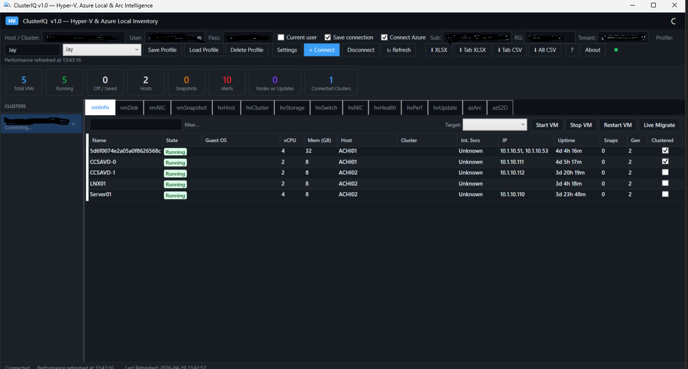
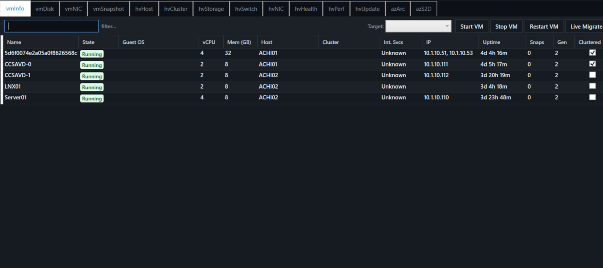
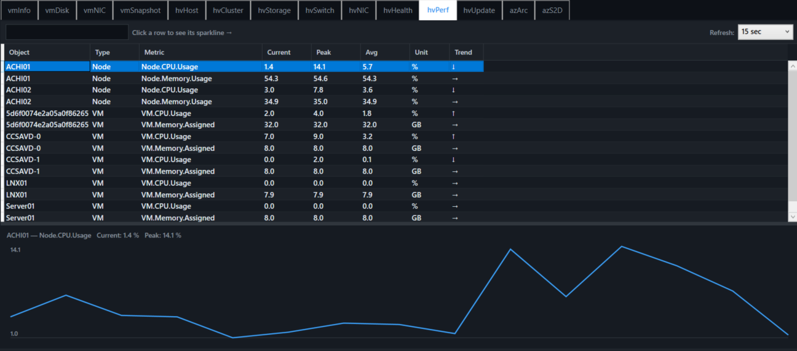
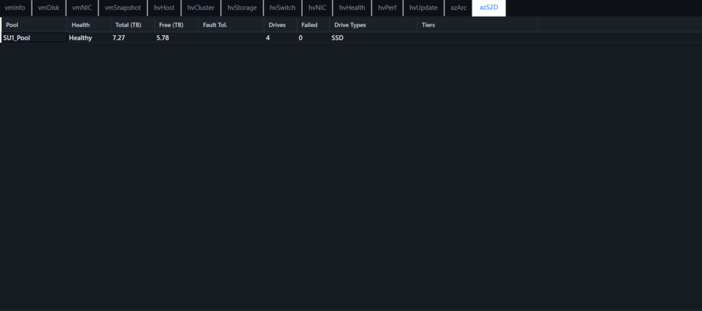

------------------------------------------------------------------------

## 📥 Download

👉 https://github.com/jaycalderwood/ClusterIQ/releases/latest

------------------------------------------------------------------------

## 📸 Screenshots

### HV Cluster View

### VM View

### HV Perf

### AZS2D

------------------------------------------------------------------------

## ✨ Key Features

-   Cluster-aware VM management
-   Live migration with Kerberos / CredSSP
-   Real-time performance monitoring
-   Azure Local / S2D insights
-   Export to CSV / Excel
-   Built-in documentation
-   GitHub-powered auto update

------------------------------------------------------------------------

## 🧭 Application Walkthrough

### HV Cluster

-   Node status and health
-   Cluster validation

### VM View

-   VM ownership and state
-   Start / Stop / Restart
-   Live migration (cluster-aware)

### HV Perf

-   CPU and memory metrics
-   Graph-based visualization

### AZS2D

-   Storage pools and disks
-   Capacity insights
-   Version-aware queries

------------------------------------------------------------------------

## ⚙️ Settings

-   Authentication mode (Kerberos / CredSSP)
-   Performance refresh interval
-   Persisted configuration

------------------------------------------------------------------------

## 🔄 Update Mechanism

1.  Query GitHub API
2.  Compare versions
3.  Download latest EXE
4.  Replace binary
5.  Restart app

------------------------------------------------------------------------

## 🧰 Requirements

-   Windows
-   Hyper-V / Azure Local environment
-   Admin privileges
-   Network access to hosts

------------------------------------------------------------------------

## ⚠️ Known Behavior

-   Some views require manual refresh
-   Performance depends on available metrics
-   S2D output varies by environment

------------------------------------------------------------------------

## 👤 Author

Jay Calderwood\
Cloud Architect \| Azure & Hyper-V Expert\
https://www.cloudythoughts.cloud
